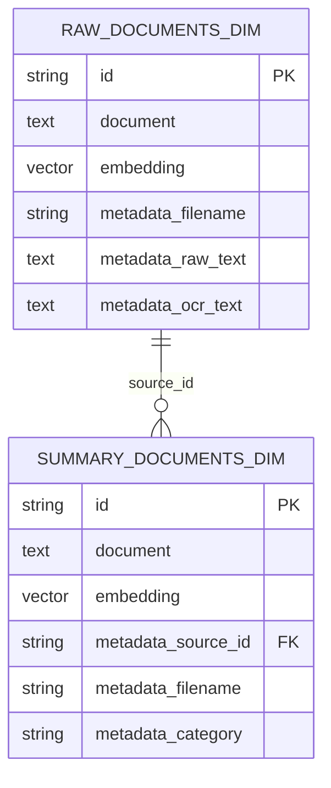

# HWP/HWPX OCR + 요약/분류 시스템

HWP/HWPX 문서에서 텍스트를 추출하고, 객체 이미지는 OCR 처리한 뒤  
Ollama LLM으로 요약/카테고리 분류까지 수행하는 프로젝트입니다.

## 기술 스택

- Backend: FastAPI
- OCR: PaddleOCR
- HWP 처리: `olefile`, `hwp-extract`
- LLM: Ollama `llama3:8b`
- Vector DB: ChromaDB
- Embedding: `sentence-transformers` (`BAAI/bge-m3` 기본)
- Frontend: React + Axios (Vite)

## 지원 파일

- `.hwp`
- `.hwpx`

## 로컬 실행

### 1) Python 가상환경

```powershell
cd C:\Users\Zenbook\Desktop\ocr-test2
py -3.10 -m venv .venv
.\.venv\Scripts\Activate.ps1
python -m pip install --upgrade pip
pip install -r backend\requirements.txt
```

### 2) Ollama 준비

```powershell
ollama pull llama3:8b
ollama run llama3:8b
```

기본 URL: `http://localhost:11434`

### 3) 백엔드 실행

```powershell
cd backend
copy .env.example .env
uvicorn app.main:app --reload --port 8000
```

### 4) 프론트 실행

```powershell
cd frontend
npm install
npm run dev
```

프론트 URL: `http://localhost:5173`

## API

### 문서 처리 시작

- `POST /api/process/start`
- form-data: `file` (`.hwp`/`.hwpx`)
- 반환: `job_id`

### 처리 상태 조회

- `GET /api/process/{job_id}`
- 반환:
  - `status` (`queued`/`running`/`completed`/`failed`)
  - `progress` (0~100)
  - `stage`
  - `message`
  - `result` (완료 시)

### 문서 검색

- `POST /api/search`

요청 예시:

```json
{
  "query": "운영위원회 인사 보수 복무 규정",
  "limit": 5
}
```

## 데이터베이스 다이어그램 (현재 구현 1:1)



실제 컬렉션명:
- `raw_documents_{dim}`
- `summary_documents_{dim}`

예: `raw_documents_1024`, `summary_documents_1024`

## 주요 환경변수 (`backend/.env`)

- `OLLAMA_URL`
- `OLLAMA_MODEL`
- `OLLAMA_TIMEOUT_SEC`
- `HWP_EXTRACT_BIN`
- `HWP_EXTRACT_ARGS`
- `EMBEDDING_MODEL_NAME`
- `EMBEDDING_PREFIX_MODE` (`bge`, `e5`, `none`)

## 참고 사항

- OCR 성능 향상을 위해 객체 이미지에 전처리(TTA: 대비/이진화/샤프닝)를 적용합니다.
- 드래그 앤 드롭 업로드를 지원합니다.
- 결과 파일 다운로드는 요약/분류 파일만 제공합니다.
